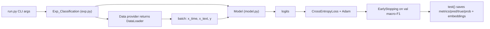
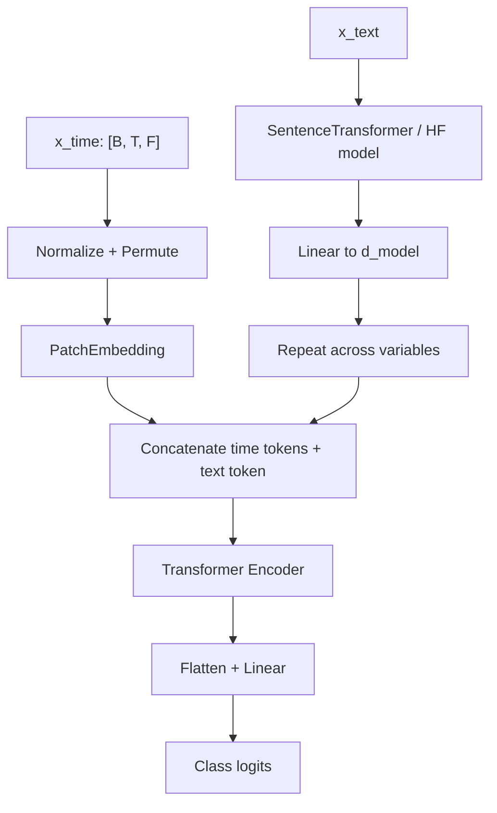
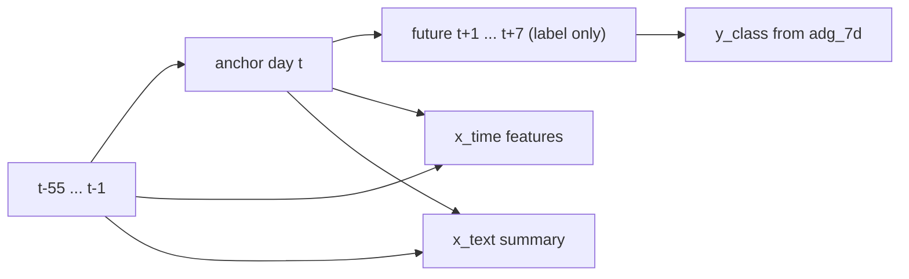
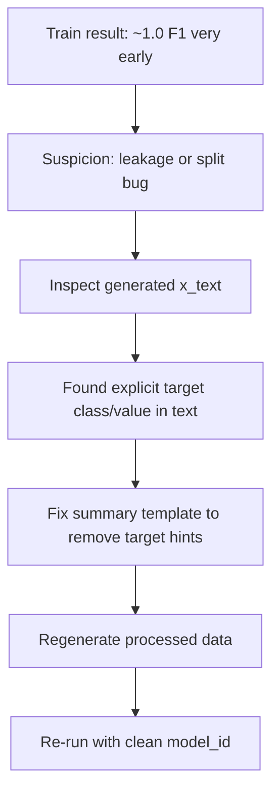

# TimeCAP x AgriWebb Journey

## 1) Why This Project Exists

The objective of this workstream was to adapt the TimeCAP research codebase to a practical livestock forecasting use case for AgriWebb:

- Inputs: historical time-series context from weather, animal weights/metadata, and paddock movement/load.
- Output: near-term animal growth class forecast (decrease / neutral / increase).
- Constraint: first pass should be **data-only integration**, preserving TimeCAP model internals.

This gave us a clean baseline to test whether TimeCAP’s time+text fusion can absorb AgriWebb-style multivariate context.

---

## 2) TimeCAP Baseline (How the Original Code Works)

TimeCAP in this repo is implemented as a classification pipeline where each sample has:

- `x_time`: a fixed-length numeric time window.
- `x_text`: a contextual summary string (or tokenized text for some LM choices).
- `y`: a class label.

Core training path:

- `/Users/ayush.kanwal/Desktop/development/TimeCAP/encoder/run.py`
- `/Users/ayush.kanwal/Desktop/development/TimeCAP/encoder/exp.py`
- `/Users/ayush.kanwal/Desktop/development/TimeCAP/encoder/model.py`

High-level execution flow:



Model internals (current implementation):

- Numeric stream: patch embedding + transformer encoder over time channels.
- Text stream: SentenceTransformer embedding (for `minilm6`, etc.) or HF backbone embedding.
- Fusion: text embedding is projected to `d_model`, repeated per channel, concatenated with time patch tokens.
- Head: flattened representation projected to class logits.

Fusion sketch:



---

## 3) Adaptation Strategy for AgriWebb

The approved strategy was:

- Do not add extra modeling tricks initially.
- Build robust preprocessing so AgriWebb data can be consumed by existing TimeCAP interfaces.
- Wire a new dataset loader (`agriwebb`) into the current data factory.

Implemented files:

- `/Users/ayush.kanwal/Desktop/development/TimeCAP/dataset/agriwebb/prepare_agriwebb.py`
- `/Users/ayush.kanwal/Desktop/development/TimeCAP/dataset/agriwebb/AGRIWEBB_DATA_PREP_PLAN.md`
- `/Users/ayush.kanwal/Desktop/development/TimeCAP/dataset/agriwebb/metadata/feature_manifest.yaml`
- `/Users/ayush.kanwal/Desktop/development/TimeCAP/encoder/data_provider/data_loader.py`
- `/Users/ayush.kanwal/Desktop/development/TimeCAP/encoder/data_provider/data_factory.py`

---

## 4) AgriWebb Data Design Decisions

### 4.1 Input Tables Used

- `farm-info.csv`
- `paddock-info.csv`
- `paddock-moves.csv`
- `weather.csv`
- `weights.csv`

### 4.2 Weight Deduplication Rule (Approved Amendment)

For each `(LIVESTOCK_ID, day)`:

1. Keep row with latest `OBSERVATION_DATE`.
2. If tied, keep latest `CREATION_DATE`.
3. If tied again, keep highest `RECORD_ID`.

This ensures one deterministic daily weight record per animal-day.

### 4.3 Prediction Target

We modeled 7-day average daily gain:

`adg_7d = (weight_{t+7} - weight_t) / 7`

Class mapping:

- `0` decrease: `adg_7d < -0.10`
- `1` neutral: `-0.10 <= adg_7d <= 0.10`
- `2` increase: `adg_7d > 0.10`

### 4.4 Windowing

- History window: 56 days.
- Horizon: 7 days.
- One sample per valid anchor day per livestock record stream.

Timeline per sample:



### 4.5 Feature Construction

Numeric features include:

- Weight context (`weight_last_obs_kg`, `days_since_last_weight`, `age_months`)
- Weather (`daily_rain_mm`, temps, humidity, THI)
- Paddock/move context (`load_mj_per_day`, land sizes, `active_move_flag`)

Categorical features are one-hot expanded:

- `record_input_type`, `sex`, `neutered`, `major_category`, `age_class`, `canon_breed`, `pasture_state`

Missingness handling:

- Numeric missing mask is explicitly appended as additional channels.
- Train-split medians are used for final NaN imputation.

---

## 5) Produced Artifacts

`/Users/ayush.kanwal/Desktop/development/TimeCAP/dataset/agriwebb/processed`

- `x_time.npy` shape `[N, 56, F]`
- `x_text.npy` shape `[N]`
- `y_class.npy`
- `y_adg_7d.npy`
- `splits.json` (chronological 60/20/20)
- `feature_names.json`
- `data_quality_report.json`
- `sample_meta.parquet` or `sample_meta.csv` fallback

Current sample count in latest build:

- `N = 15,877`

---

## 6) Loader Integration into TimeCAP

Added `Dataset_AgriWebb` in:

- `/Users/ayush.kanwal/Desktop/development/TimeCAP/encoder/data_provider/data_loader.py`

Key behavior:

- Reads processed `.npy` + `splits.json`.
- Supports `TRAIN/VAL/TEST/ALL`.
- Returns `(seq_x_time, seq_x_text, seq_y)` in the same contract as existing datasets.
- Handles both tokenizer-based LM modes and SentenceTransformer modes.

Registered in:

- `/Users/ayush.kanwal/Desktop/development/TimeCAP/encoder/data_provider/data_factory.py`

with:

- `data_dict['agriwebb'] = Dataset_AgriWebb`

---

## 7) Runtime and Environment Challenges Solved

### 7.1 Dependency Mismatch

We hit a `torchvision::nms` runtime error caused by inconsistent `torch`/`torchvision`/`torchaudio` families in the env.

Resolution:

- align versions in one coherent family before running.

### 7.2 NumPy Object-Array Compatibility

We hit:

- `ModuleNotFoundError: No module named 'numpy._core'`

Cause:

- `x_text.npy` created as pickled object array under a different NumPy major version.

Fixes:

- loader compatibility shim for legacy object arrays.
- preprocessing changed to save text as Unicode array with `allow_pickle=False`.

### 7.3 Optional Parquet Engine

In envs without `pyarrow`/`fastparquet`, preprocessing failed at parquet write.

Fix:

- fallback to `sample_meta.csv` if parquet engine is unavailable.

---

## 8) Experiment Incident: Why the First Metrics Were “Too Good”

Initial run produced near-perfect scores very quickly.

Root cause was data leakage in generated text summaries:

- Text included direct target info (`ADG class`, `adg_7d`), making classification trivial.

Leakage diagnosis logic:



Additional evaluation fix:

- `test()` in `/Users/ayush.kanwal/Desktop/development/TimeCAP/encoder/exp.py` was updated to evaluate `TEST` split, not `ALL`.

---

## 9) Git Hygiene Improvements

To prevent large/private artifacts from pushing:

- Added ignore rules in `/Users/ayush.kanwal/Desktop/development/TimeCAP/.gitignore` for:
  - `dataset/agriwebb/processed/`
  - `dataset/agriwebb/**/*.csv`
  - `__pycache__/`, `*.py[cod]`
  - `encoder/checkpoints/`, `encoder/logs/`, `encoder/results/`

Also cleaned tracked cache artifacts from history/index and pushed clean commits.

---

## 10) Current State (As of This Checkpoint)

What is now true:

- AgriWebb data pipeline is implemented and reproducible.
- TimeCAP loader wiring for `--data agriwebb` is implemented.
- Leakage from text labels has been removed in preprocessing.
- Evaluation now targets the true test split.
- Repo push path is clean from large generated data and pycache noise.

What remains:

- Finish/inspect clean retraining run (`agriwebb_v2_noleak` recommended model id).
- Establish realistic baseline metrics after leakage removal.
- Only then compare architecture or prompt/data variants.

---

## 11) Suggested “Journey” Storyline for External Documentation

Use this narrative arc in your final document:

1. Motivation
   - Why mixed agri context needs time-series contextualization.
2. Baseline understanding
   - TimeCAP internals and where to integrate safely.
3. Data engineering
   - Converting raw farm data into deterministic learning windows.
4. Integration
   - Plugging into existing training stack with minimal model edits.
5. Debugging reality
   - Dependency issues, format incompatibilities, and leakage detection.
6. Scientific discipline
   - Rejecting “too good to be true” metrics and fixing evaluation integrity.
7. Next phase
   - Clean baselines first, then model improvements.

---

## 12) Repro Commands Snapshot

Rebuild processed AgriWebb data:

```bash
cd /Users/ayush.kanwal/Desktop/development/TimeCAP
python dataset/agriwebb/prepare_agriwebb.py \
  --input-dir dataset/agriwebb \
  --output-dir dataset/agriwebb/processed
```

Run training/eval:

```bash
cd /Users/ayush.kanwal/Desktop/development/TimeCAP/encoder
MPLCONFIGDIR=/tmp/mpl python run.py \
  --data agriwebb \
  --root_path agriwebb \
  --data_path ../dataset/agriwebb/processed \
  --model_id agriwebb_v2_noleak \
  --lm_model minilm6 \
  --n_heads 4 \
  --num_workers 0
```

---

## 13) Key Takeaway

The most important progress so far is not a high score; it is building a leak-resistant, reproducible path from raw AgriWebb operational data into TimeCAP’s multimodal forecasting pipeline. That foundation is what makes future model comparisons credible.

