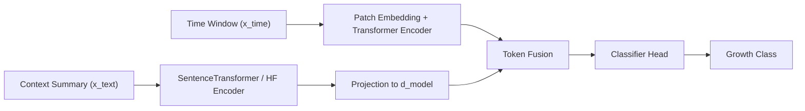
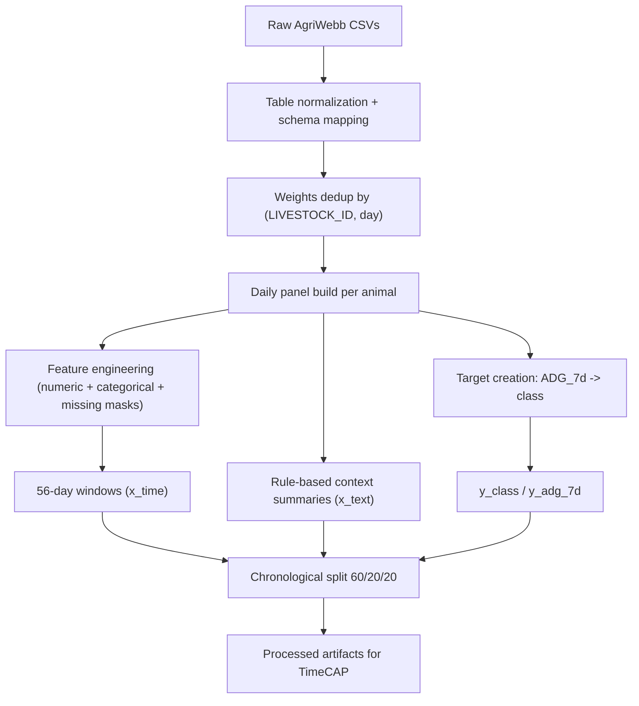
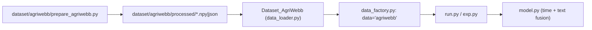

# TimeCAP x AgriWebb Journey (Presentation Edition)

## 1) Executive Summary

This project adapts TimeCAP from paper code into a practical livestock growth forecasting workflow using AgriWebb data.

- **Goal:** predict near-term animal growth class (`decrease`, `neutral`, `increase`)
- **Inputs:** weather + weights + paddock moves/load + livestock context
- **Approach:** data-first integration, preserve model internals, validate rigorously
- **Outcome so far:** stable end-to-end pipeline, leakage fixed, realistic training behavior observed

---

## 2) Problem We Set Out to Solve

Agri operations decisions depend on **multi-source temporal context**:

- weather pressure on growth
- paddock carrying/load conditions
- measurement patterns (`Bulk` vs `Individual`)
- animal-level history (weight trend, age class, breed/sex context)

We needed one unified model-ready view of this context, not disconnected tables.

---

## 3) What TimeCAP Contributes

TimeCAP combines:

1. **Numerical time-series encoder**
2. **Text contextualization encoder**
3. **Fusion for classification**

---

## 4) Adaptation Strategy (Deliberate Constraints)

To keep first results trustworthy:

- No model architecture changes for v1 adaptation
- Build deterministic, auditable preprocessing
- Keep strict temporal causality (features up to `t`, target from `t+7`)
- Add AgriWebb as a clean dataset plug-in to existing TimeCAP loaders

This gave us a valid baseline before experimenting with advanced improvements.

---

## 5) Data Pipeline We Built

### Approved dedup rule (implemented)
For each `(LIVESTOCK_ID, day)` keep latest by:
1. `OBSERVATION_DATE`
2. `CREATION_DATE` (tie-break)
3. `RECORD_ID` (final tie-break)

---

## 6) Architecture + Data Contract After Integration

Produced artifacts include:

- `x_time.npy` (`[N, 56, F]`)
- `x_text.npy` (`[N]`)
- `y_class.npy`, `y_adg_7d.npy`
- `splits.json`, `feature_names.json`, `data_quality_report.json`

---

## 7) Key Issues We Hit (and Fixed)

| Issue | Symptom | Root Cause | Fix | Status |
|---|---|---|---|---|
| Environment mismatch | `torchvision::nms` runtime error | incompatible `torch/torchvision/torchaudio` versions | aligned dependency stack | Fixed |
| NumPy compatibility | `No module named numpy._core` loading `x_text.npy` | object-pickled array created under different NumPy major version | unicode save (`allow_pickle=False`) + legacy loader fallback | Fixed |
| Data leakage in text | near-perfect F1 too early | summaries contained true target (`ADG class`, `adg_7d`) | removed target fields from summary template + regenerated processed data | Fixed |
| Evaluation scope bug | inflated final score reporting | `test()` evaluated `ALL` split | switched to `TEST` split evaluation | Fixed |
| Git push failure | rejected by GitHub size limit | tracked large generated files (e.g., `x_time.npy`) | history cleanup + `.gitignore` for processed/csv/cache artifacts | Fixed |

---

## 8) Metrics Story: Before vs After Integrity Fixes

### Before fixes (invalid due leakage)
- Reached ~1.0 macro-F1 rapidly
- Model effectively read labels from text context

### After leakage + eval fixes (credible)
- Early epochs now show realistic behavior
- Example progression from current run:
  - Epoch 1: Vali-Macro `0.293`, Test-Macro `0.257`
  - Epoch 3: Vali-Macro `0.428`, Test-Macro `0.492`

Interpretation: now learning signal is plausible and no longer “too good to be true.”

---

## 9) Why This Matters

The biggest win is not a headline metric yet; it is **experimental integrity**:

- reproducible preprocessing
- leakage-aware validation
- correct split evaluation
- version-safe artifacts
- clean repository hygiene

This foundation makes future model improvements scientifically meaningful.

---

## 10) What We’re Doing Next

1. Complete clean baseline run (`agriwebb_v2_noleak`)
2. Review confusion matrix and class-wise F1
3. Analyze failure slices (record type, age class, farm, weather regime)
4. Only then iterate on modeling choices (text prompt style, feature set, horizon variants)

---

## 11) Code Map (for Q&A)

- Pipeline: `/Users/ayush.kanwal/Desktop/development/TimeCAP/dataset/agriwebb/prepare_agriwebb.py`
- Dataset integration: `/Users/ayush.kanwal/Desktop/development/TimeCAP/encoder/data_provider/data_loader.py`
- Dataset registry: `/Users/ayush.kanwal/Desktop/development/TimeCAP/encoder/data_provider/data_factory.py`
- Train/test loop: `/Users/ayush.kanwal/Desktop/development/TimeCAP/encoder/exp.py`
- TimeCAP model: `/Users/ayush.kanwal/Desktop/development/TimeCAP/encoder/model.py`
- Technical deep-dive doc: `/Users/ayush.kanwal/Desktop/development/TimeCAP/docs/TIMECAP_AGRIWEBB_JOURNEY.md`

